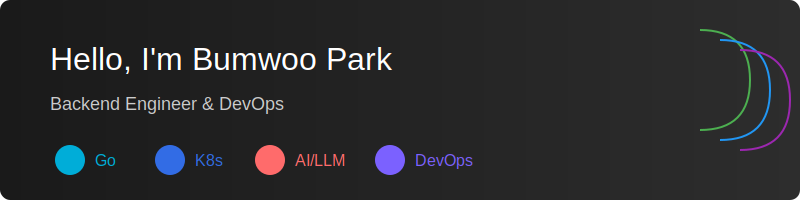

    

## About Me 🚀

Senior Backend Engineer with 9 years of experience, specialized in:
- 💻 High-performance Go/gRPC server development
- 🛠 Kubernetes & Cloud Infrastructure
- 🤖 AI/LLM Application Development
- 🔄 DevOps & System Architecture

## Tech Stack 💪

    
    &nbsp;
    &nbsp;
    
    &nbsp;
    &nbsp;
    
    &nbsp;
    &nbsp;
    
    &nbsp;
    &nbsp;
    

    
    &nbsp;
    &nbsp;
    
    &nbsp;
    &nbsp;
    
    &nbsp;
    &nbsp;
    
    &nbsp;
    &nbsp;
    

## Key Projects 🌟

### Snap - Multi LLM/Agent System
- Built an innovative LLM-based chatbot using Python, Go, and gRPC
- Implemented multi-agent architecture for enhanced user interaction
- Successfully led PoC and technical development

### DevOps Infrastructure Enhancement
- Led migration from Spinnaker to ArgoCD GitOps
- Implemented Linkerd service mesh and Argo Rollouts
- Achieved 20% cloud cost reduction and 50% deployment stability improvement

### High-Performance Image Storage
- Optimized image processing architecture using GCP Cloud Storage
- Implemented signed URL system and process agent separation
- Reduced p99 latency by 40%

## GitHub Stats 📊

## Let's Connect 🤝

    
    &nbsp;
    &nbsp;
    
    &nbsp;
    &nbsp;
    

---

📫 Contact: qjadn0914@gmail.com

